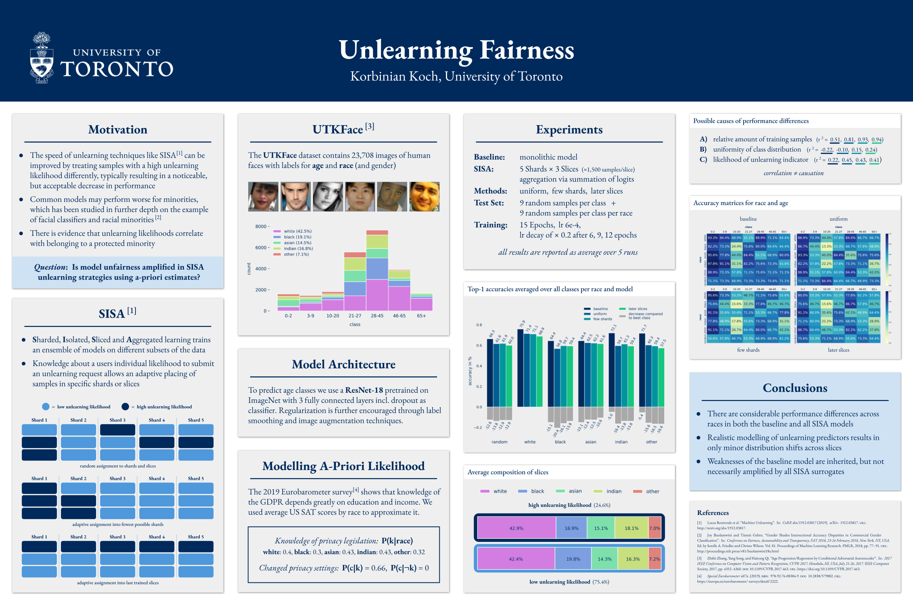

<h1 align="center">Unlearning Fairness</h4>

<p align="center">
  <a href="#-about">About</a> •
  <a href="#%EF%B8%8F-research-poster">Research Poster</a> •
  <a href="#%EF%B8%8F-installation">Installation</a> •
  <a href="#%EF%B8%8F-license">License</a>
</p>

## 💡 About

This repository is the result of a research project done for the course **Trustworthy Machine Learning** instructed and supervised by [Nicolas Papernot](https://www.papernot.fr/).

It explores how different strategies using [Sharded, Isolated, Sliced and Aggregated (SISA) unlearning](https://arxiv.org/abs/1912.03817) affect model fairness using the example of a facial age classifier and race as protected attribute.

I reimplemented SISA from scratch in PyTorch using a custom dataset, dataloader and model. Experiment tracking was done using wandb.

## 👁️ Research Poster

For a quick summary of this project, take a look at my resarch poster (click on the image below to open it in Google PDF Viewer).

[](https://docs.google.com/viewer?url=https://github.com/epistoteles/unlearning-fairness/raw/master/Unlearning%20Fairness%20Poster.pdf)


## ⚙️ Installation

The script `setup.sh` will prepare a newly created Google Cloud Virtual Machine (I used 32GB RAM and a single V100) to be able to run the experiments (download UTKFace dataset, install CUDA, clone repository, connect wandb, etc.). You will have to modify line `21`, `24` and `25` to include your GitHub username, email and access token. If you don't want to use GCP you can simply use the script as a step-by-step guide, leaving out the GCP-specific stuff like buckets.

Run a 5-fold cross-validated run with e.g.
```
python3 train.py --num_shards 5 --num_slices 3 --strategy random-balanced --put_in slice
```
meaning you are training a SISA model with 5 shards (3 slices each) using a sorted balanced sampling strategy that puts high-unlearning-likelihood samples in later slices.

Evaluate your run with
```
python3 evaluate.py --run_dir <your-run-name>
```
The results over all 5 folds will be written as a pickled summary to `summaries/`.


## ⚠️ License
This repository has been published under the MIT license (see the file `LICENSE.txt`).
